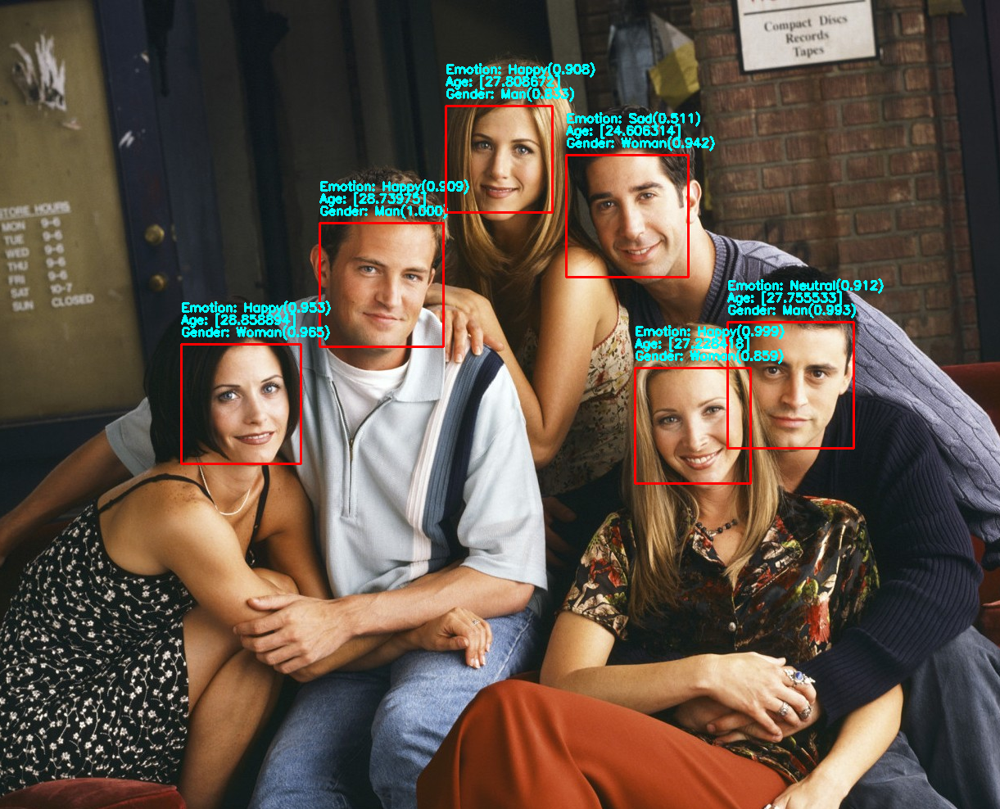

## General information

The folder code has the detector code. \
The folder models contains the trained models. \
Notebooks contains the code used to process data, build and train models. 

## Requirements

* You have to install python3 and pip3 commands

* Then install all dependencies by executing the following commands :
```
pip3 install -r requirements.txt
```


## How to use the application
* All commands should be executed in terminal in the same directory as this file , be aware not to be in conda environment ``conda deactivate``

* First execute :
	
	`` source ./bin/detector.sh ``
	
* Then , to get more information on how to use detector command:
	
	`` detector help ``
	
	
	
## Results
   

## Technologies
* Python 
* Tensorflow 
* Pytorch 
* OpenCV 
* Flask
* Heroku
